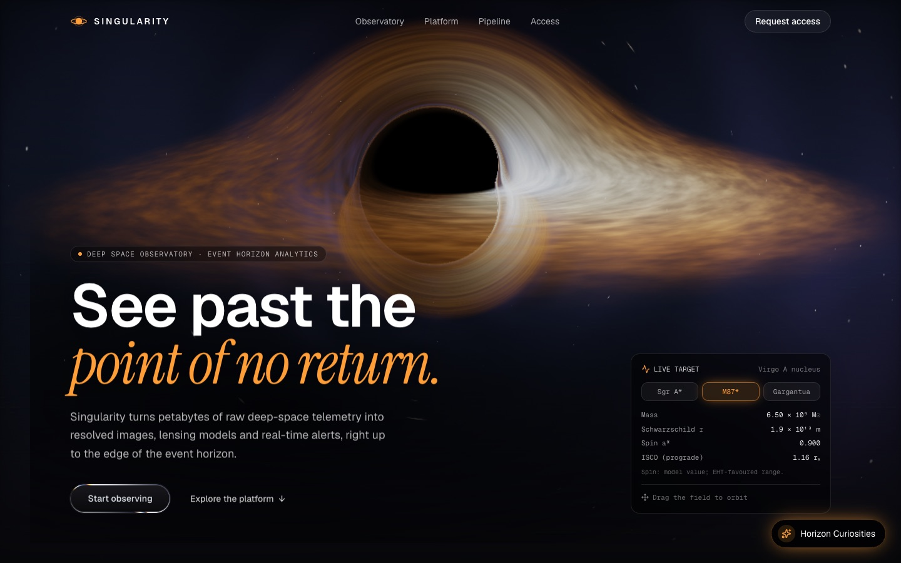
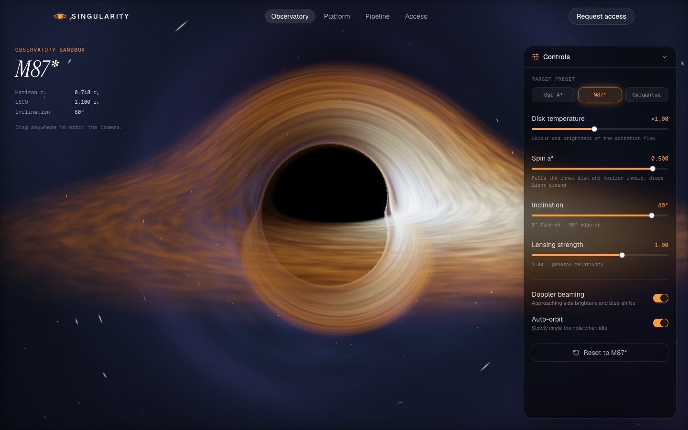
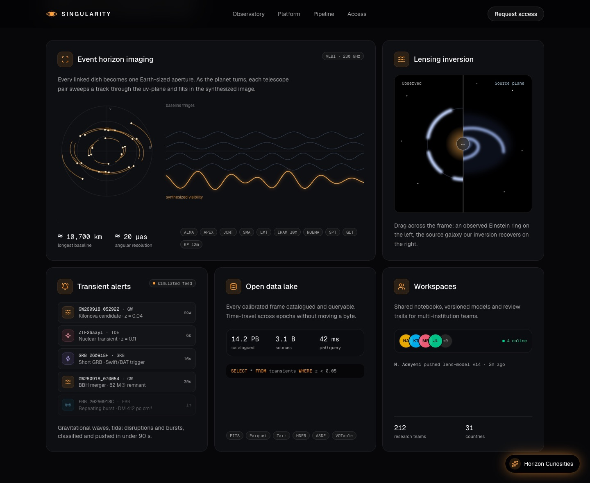
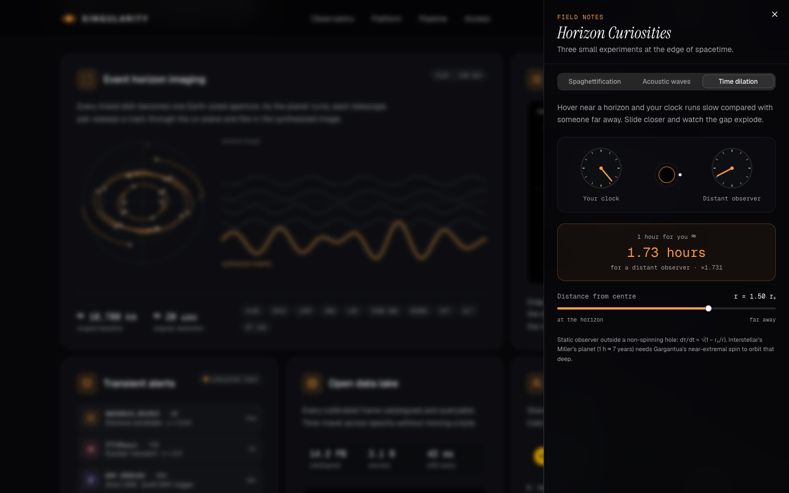
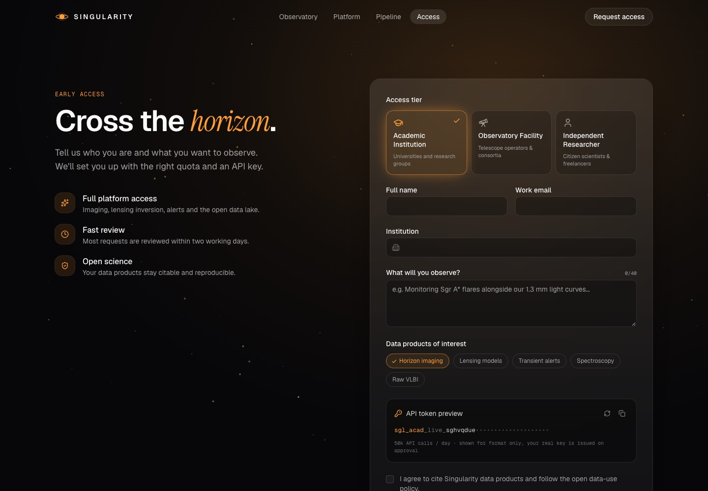
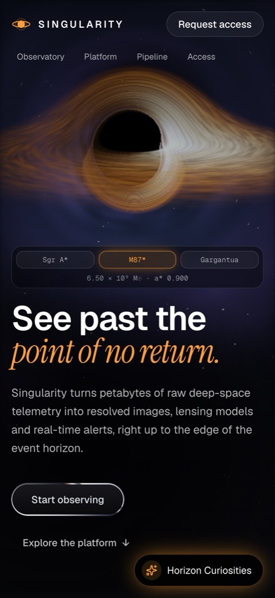

<div align="center">


# Singularity

**Deep Space Observatory & Event Horizon Analytics**

An interactive deep-space observatory and event horizon analytics platform, featuring
real-time WebGL black hole simulations and GLSL shader interfaces, all ray-traced live in your browser.

[](https://nextjs.org)
[](https://react.dev)
[](https://www.typescriptlang.org)
[](https://tailwindcss.com)
[](https://developer.mozilla.org/docs/Web/API/WebGL_API)



</div>

## ✨ Highlights

- **A real-time black hole.** A custom GLSL shader bends light around the hole, so you see the
  famous "halo" of the far side of the disk, Doppler-brightened gas and a starfield. Drag to orbit.
- **Switch between real black holes.** Jump between Sgr A\*, M87\* and Interstellar's Gargantua;
  the numbers animate and the shader morphs to match.
- **An interactive sandbox** (`/observatory`) with sliders for spin, disk temperature, viewing
  angle, lensing strength and Doppler beaming.
- **A live dataflow diagram** (`/pipeline`): watch data packets travel from radio telescopes to
  alerts, and inject your own transient.
- **Horizon Curiosities**: little physics toys: spaghettification, the "sound" of the Perseus
  black hole, and a time-dilation calculator.
- **Built to be kind to devices**: adaptive resolution, rendering pauses when off-screen,
  respects `prefers-reduced-motion`, and releases GPU memory when you change pages.

## 📸 Tour

| Observatory sandbox | Platform bento grid |
| :---: | :---: |
|  |  |
| **Interactive pipeline** | **Horizon Curiosities** |
|  |  |
| **Request access** | **On your phone** |
|  |  |

## 🚀 Run it on your computer

You need [Node.js](https://nodejs.org) **20.9 or newer** (check with `node -v`).

```bash
git clone https://github.com/claudiu1910/Singularity-Observatory.git
cd Singularity-Observatory
npm install
npm run dev
```

Then open **http://localhost:3000**. Edits you make to the files show up in the browser instantly.

| Command | What it does |
| --- | --- |
| `npm run dev` | Starts the development server with live reload |
| `npm run build` | Creates an optimized production build |
| `npm start` | Serves the production build (run `build` first) |
| `npm run lint` | Checks the code for common mistakes |

## 🌍 Put it online

The easiest way is [Vercel](https://vercel.com) (free for personal projects). Click the button,
sign in with GitHub and it deploys automatically on every push:

[](https://vercel.com/new/clone?repository-url=https%3A%2F%2Fgithub.com%2Fclaudiu1910%2FSingularity-Observatory)

## 🗂️ Project structure

```text
app/
  page.tsx                  Home page (hero, stats, bento grid, pipeline teaser, call to action)
  observatory/page.tsx      Full-screen black hole sandbox
  pipeline/page.tsx         Interactive dataflow diagram
  access/page.tsx           Access request form
components/
  ui/
    optimized-black-hole.tsx            React wrapper around the renderer
    optimized-black-hole-utils/
      renderer.ts                        WebGL setup, camera, animation loop, cleanup
      shaders.ts                         The GLSL ray tracer
      physics.ts                         Kerr ISCO, horizon and time-dilation formulas
    liquid-metal-button.tsx              Animated metallic button (Paper Shaders)
    …                                    shadcn/ui primitives (slider, sheet, tabs…)
  landing/                  Home page sections (hero HUD, bento cards, header, particles…)
  curiosities/              The three Horizon Curiosities toys
  observatory/              Sandbox controls
  pipeline/                 Dataflow diagram and its data
  access/                   Access form
lib/                        Shared data and helpers (black hole presets, form submission)
hooks/                      Small reusable React hooks
```

## 🔭 How the black hole works

Every pixel shoots a ray from the camera and steps it through space. At each step the ray is
pulled towards the hole with the photon-orbit approximation `a = −1.5·h²·r̂ / r⁴`, which
reproduces the photon sphere at 1.5 Schwarzschild radii. Whenever a ray crosses the disk plane,
the shader samples swirling noise for the gas, colours it by temperature, and brightens or dims it
by relativistic Doppler beaming. Rays that fall inside the horizon stay black; rays that escape
sample a procedural starfield.

Spin is an artistic approximation: it moves the inner disk edge using the real Kerr ISCO formula
and adds a gentle frame-dragging twist, which flattens one side of the shadow the way real
spinning black holes do.

## 📝 Good to know

- **Singularity is a fictional product.** Statistics, alerts, team members and code samples are
  illustrative. Black hole masses and radii are real; the preset spins are model values.
- **The access form doesn't send data yet.** `submitAccessRequest` in `lib/access-request.ts`
  simulates a request. Connect it to your own API route or form service before relying on it.
- **Needs WebGL.** Every modern browser supports it; without it the page still works, just without
  the animated black hole.

## 🧰 Built with

[Next.js](https://nextjs.org) ·
[React](https://react.dev) ·
[TypeScript](https://www.typescriptlang.org) ·
[Tailwind CSS](https://tailwindcss.com) ·
[shadcn/ui](https://ui.shadcn.com) + [Base UI](https://base-ui.com) ·
[Paper Shaders](https://shaders.paper.design) ·
[Lucide icons](https://lucide.dev) ·
fonts: Geist and Instrument Serif
